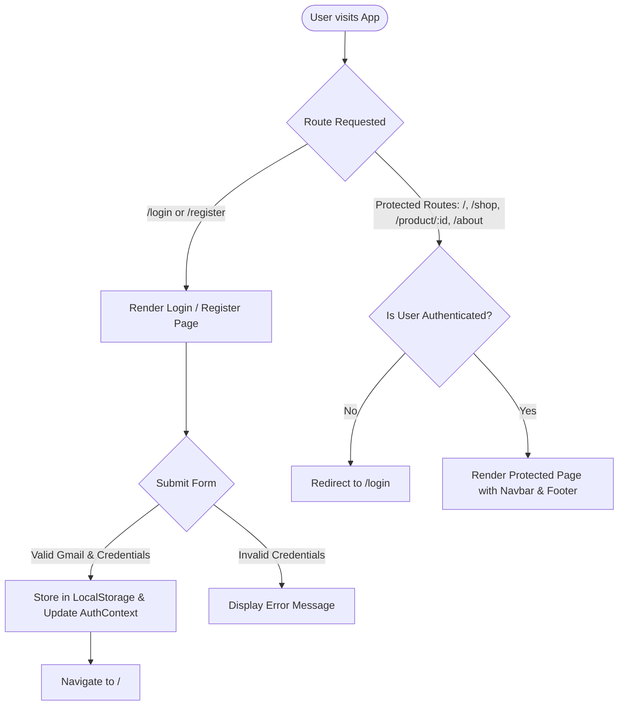
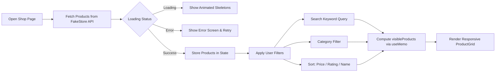
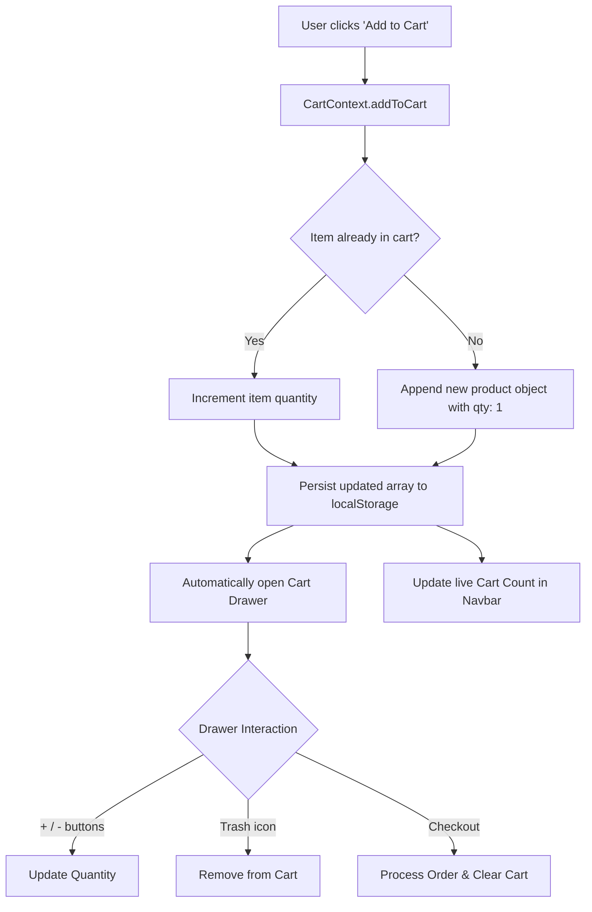

# ⚡ SkyMart — Modern E-Commerce Web Application

SkyMart is a high-performance, dark-themed, and **fully responsive frontend** e-commerce single-page application (SPA) built with **React 19**, **Vite**, and **TailwindCSS v4**. It features real-time product catalogs powered by the **FakeStore API**, client-side authentication with route protection, and a persistent global slide-over cart.

---

## 📱 Fully Responsive Frontend Design

SkyMart is engineered from the ground up with a **mobile-first, adaptive responsive layout**:

- **📱 Mobile (< 640px):**
  - Smooth collapsible hamburger navigation menu with direct access to pages and logout.
  - 2-column compact product card grid optimized for touch scrolling.
  - Full-width slide-over Cart Drawer tailored for mobile viewports.
  - Adaptive filter bars with easy-to-tap dropdowns and search inputs.

- **💻 Tablet (640px – 1024px):**
  - Flexible 3-column product grid.
  - Condensed navigation bar showing active user indicators.
  - Responsive About and Stats sections transitioning smoothly into multi-column layouts.

- **🖥️ Desktop (≥ 1024px):**
  - Expanded 4 to 5-column product catalog layout with hover states and micro-interactions.
  - Full horizontal navigation with live active route indicators, user profile pill, and cart counters.
  - Sleek dark aesthetic (`#0d0d0d`) with vibrant lime-green (`#a3e635`) accents and glassmorphism borders.

---

## 🚀 Key Features

- **🔐 Client-Side Authentication & Session Persistence:**
  - Secure Gmail-only verification policy (`@gmail.com`).
  - User registration and login persisted in browser `localStorage`.
  - Session state managed via React Context (`AuthContext`).
  - Protected Route guards redirecting unauthorized visitors to `/login`.

- **🛍️ Dynamic Shop & Filter Engine:**
  - Real-time client-side search filtering by product title.
  - Dynamic category pills and dropdown filters loaded from FakeStore API.
  - Multi-criteria sorting:
    - *Price: Low to High*
    - *Price: High to Low*
    - *Highest Rated*
    - *Alphabetical (A - Z)*
  - Loading skeleton states (`animate-pulse`) for smooth perceived performance.

- **🛒 Global Slide-over Cart Drawer:**
  - Accessible anywhere in the application with a single click.
  - Add, increment, decrement, and remove items with automatic subtotal calculation.
  - Auto-saved to `localStorage` so items remain after refreshing or reopening the browser.

- **📄 Dedicated Product Details (`/product/:id`):**
  - Deep-dive into item specifications, high-resolution imagery, pricing, and customer ratings.

---

## 🔄 Architecture & Working Flowcharts

### 1. Application Navigation & Route Guard Flow



---

### 2. Product Browsing & Filtering Flow



---

### 3. Cart State Management Flow



---

## 🛠️ Tech Stack

| Layer | Technology | Description |
| :--- | :--- | :--- |
| **Frontend Framework** | React 19 | Component-driven UI development |
| **Bundler & Dev Server** | Vite 7 | Lightning-fast HMR and bundling |
| **Styling** | TailwindCSS v4 | Modern utility-first CSS framework |
| **Routing** | React Router v7 | Client-side routing and protected routes |
| **Typography** | Poppins (@fontsource/poppins) | Clean modern sans-serif typography |
| **Icons** | Lucide React | Clean, scalable SVG icon system |
| **Backend API** | FakeStore API | External REST API for e-commerce data |
| **State Management** | React Context API | Global authentication and cart state |

---

## 📂 Project Structure

```text
SkyMart-main/
├── public/                 # Static assets
├── src/
│   ├── api/
│   │   └── fakeStoreApi.js # FakeStore REST API endpoints
│   ├── components/
│   │   ├── About/          # About page components (Hero, Stats, Team, Values)
│   │   ├── Cart/           # Slide-over Cart Drawer and Cart Items
│   │   ├── Categories/     # Category cards and showcase
│   │   ├── Features/       # Feature cards & perks
│   │   ├── Footer/         # Footer with quick links
│   │   ├── Hero/           # Homepage hero banner
│   │   ├── Navbar/         # Responsive navbar with mobile drawer
│   │   ├── Products/       # Product list & card components
│   │   ├── ProtectedRoute.jsx # Route authentication wrapper
│   │   ├── Shop/           # Shop filters, header, and product grid
│   │   └── Stats/          # Metric counters & stats
│   ├── context/
│   │   ├── AuthContext.jsx # User authentication & persistence
│   │   └── CartContext.jsx # Cart actions, count, and totals
│   ├── data/               # Mock data (categories, about, stats)
│   ├── hooks/
│   │   ├── useProduct.js   # Single product hook
│   │   └── useProducts.js  # All products fetch hook
│   ├── pages/
│   │   ├── About.jsx       # About page
│   │   ├── Home.jsx        # Landing page
│   │   ├── LoginPage.jsx   # Login page
│   │   ├── ProductDetail.jsx # Product specification page
│   │   ├── RegisterPage.jsx# Account creation page
│   │   └── Shop.jsx        # Catalog with search, filter & sort
│   ├── App.jsx             # Router and global provider mounting
│   ├── index.css           # Global Tailwind CSS imports
│   └── main.jsx            # React root entry point
├── index.html              # HTML template
├── package.json            # Dependencies and scripts
└── vite.config.js          # Vite configuration
```

---

## 💻 Getting Started

### Prerequisites
Make sure you have [Node.js](https://nodejs.org/) installed (version 18 or higher recommended).

### Installation & Local Setup

1. **Clone the repository:**
   ```bash
   git clone https://github.com/vijaychandra1910/SkyMart.git
   cd SkyMart
   ```

2. **Install dependencies:**
   ```bash
   npm install
   ```

3. **Start the development server:**
   ```bash
   npm run dev
   ```

4. **Access the application:**
   Open your browser and navigate to `http://localhost:5173`.

---

## 📝 Usage Notes

- **Sign Up / Login:** The application requires a valid `@gmail.com` address (e.g. `vijay@gmail.com`) for registration and login.
- **Cart:** Cart items persist in your browser even after page reloads.

---

## 📄 License
This project is open-source and available under the [MIT License](LICENSE).
